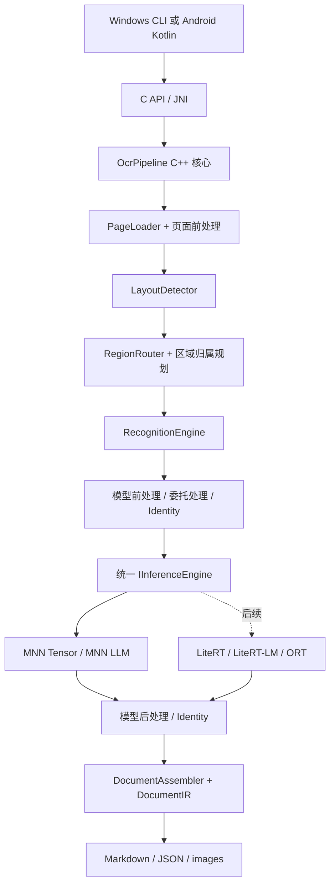

# docprase：离线文档解析

使用可移植 C++17 核心、PP-DocLayoutV3-MNN 和 OvisOCR2-MNN，将清晰的试卷、教材图片及 PDF 转为 DocumentIR、Markdown、JSON 与图片资源。当前交付范围是 Linux 命令行程序及公共 C ABI；Windows 与 Android 仍属于待验证的平台范围。

## 当前能力与质量状态

已实现单页图片、多页 PDF 与页范围、区域内容归属、阅读顺序、公式/表格输出、进度与取消、定向重试，以及从 JSON 重新导出。Ovis 执行 text / formula / table 三类识别；图片保存为资源，内嵌公式与表格子块由父区域输出一次。当前真实识别作业使用 DocumentIR 1.9，重新导出兼容 1.0～1.9。

工程能力与模型质量分别验收。首轮 Linux 实施票已关闭，整体识别质量仍由 [#24](https://github.com/bestkojima/docprase/issues/24) 和 [#27](https://github.com/bestkojima/docprase/issues/27) 跟踪；[#25](https://github.com/bestkojima/docprase/issues/25) 按用户豁免结案，实测质量未达原门槛。项目规格和最新任务状态以 [GitHub Issues](https://github.com/bestkojima/docprase/issues) 为准。

## 构建与使用

需要 C++17 编译器、CMake 3.20 及以上、已构建的 MNN/LLM 运行时与配置中固定的模型工件；PDF 还需要 `pdfinfo` 和 `pdftoppm`。模型和运行时均为外部工件。完整准备、配置和失败排查见 [Linux 运行指南](docs/linux-current.md)。从仓库根目录执行：

```sh
cmake -S . -B build/linux-current -DCMAKE_BUILD_TYPE=Release \
  -DDOCOCR_REQUIRE_MNN=ON -DDOCOCR_REQUIRE_LLM=ON \
  -DDOCOCR_MNN_ROOT=../MNN
cmake --build build/linux-current -j2
ctest --test-dir build/linux-current --output-on-failure

# 用实际路径替换输入与输出；每次使用新的输出目录。
build/linux-current/dococr_cli --config configs/printed-page.example.json \
  --input '/绝对路径/页面.png' --out 'output/页面作业'
build/linux-current/dococr_cli --reexport 'output/页面作业/document.json' \
  --asset-root 'output/页面作业' --out 'output/页面重新导出'
```

CTest 使用 Python 及 Pillow、jsonschema、markdown-it-py 等测试依赖；可通过 `Python3_EXECUTABLE` 指定已有测试环境。CLI 本身无需 Python 服务。退出码 0 表示作业和导出完成，仍须检查文档及块状态、原图和原始模型输出。

## 文档与契约入口

| 入口 | 用途 |
|---|---|
| [现行文档索引](docs/README.md) | 当前运行、领域行为、契约、评测与源码导航 |
| [DocumentIR Schema](schemas/document-ir/README.md) | 生产构建和当前回归使用的版本化契约 |
| [历史 Issue 证据索引](docs/evidence-index.md) | 按领域找到验收报告、冻结材料、失败证据和待完成任务 |
| [公共 C ABI](include/dococr/dococr.h) | 作业创建、运行、取消、事件、结果与资源所有权 |
| [生产配置](configs/printed-page.example.json) | 实际模型绑定、工件 SHA 与执行预算 |

生产 Schema 位于 `schemas/document-ir/`。历史 `docs/issue-*` 及冻结副本保持原路径与原字节；[SHA 清单](schemas/document-ir/SHA256SUMS) 可核对稳定副本与来源。历史评分脚本继续绑定其原候选和工具版本，详见证据索引。

## 早期设计记录

以下记录保留初始设计与已有初始化补充。当前能力、平台范围和契约以本页前面的现行入口为准。

<details>
<summary>2026-09-26 设计草案与早期初始化记录</summary>

# 端侧文档理解系统：需求与设计文档

版本：1.1 草案；资料核对日期：2026-09-26。

本设计根据用户提供的 OCR 调研及本轮确认编写。**首版在 Windows 上实现 Layout + VLM，全流程优先 MNN；后续迁移 Android，通过 JNI 调用同一套 C++ 核心。**传统 det+rec 路线保留完整架构位置，放在后续阶段。交付物是设计文档，不代表模型已经转换成功或完成设备性能验证。

## 阅读入口

| 文档 | 主要读者 | 内容 |
|---|---|---|
| [需求与处理流程](01-需求与处理流程.md) | 产品、算法、开发者 | 需求、模型约束、前处理、后处理、坐标、路由、文档输出 |
| [统一引擎与平台接口](02-统一引擎与平台接口.md) | C++、Android、引擎开发者 | 统一接口、可选处理链、MNN/LiteRT 适配、生命周期、JNI、构建 |
| [实施验收与参考依据](03-实施验收与参考依据.md) | 实现 Agent、技术负责人 | 开发顺序、验收用例、RapidDoc 源码映射、证据与未决项 |
| [确定模型与配置决策](04-确定模型与配置决策.md) | 全部读者 | PP-DocLayoutV3 + OvisOCR2 的实际包信息、配置管理与处理决策 |

首版模型已经明确为 `dr3334/PP-DocLayoutV3-mnn` + `dr3334/ovrics-ocrv2_mnn`。GLM 是后续扩展，不参与首版默认选型。已经通过 ModelScope API 核对文件清单与小型配置文件；权重推理和数值对齐仍待验证。拟议配置见 [pipeline.yaml](configs/pipeline.yaml)。

核心结构：



统一接口统一的是调用、生命周期和错误语义，不假设张量网络与自回归 VLM 具有相同输入。前后处理允许为空，但输入输出验证、坐标追踪和文档序列化始终存在。业务层不得依赖 MNN、LiteRT、JNI 类型。

尚未收到现有 C++ 引擎代码，因此本文接口是建议契约；接入已有工程时先做接口差异映射，再决定采用、适配或替换。芯片、内存、速度目标尚未确认，文档不虚构性能承诺。

</details>
