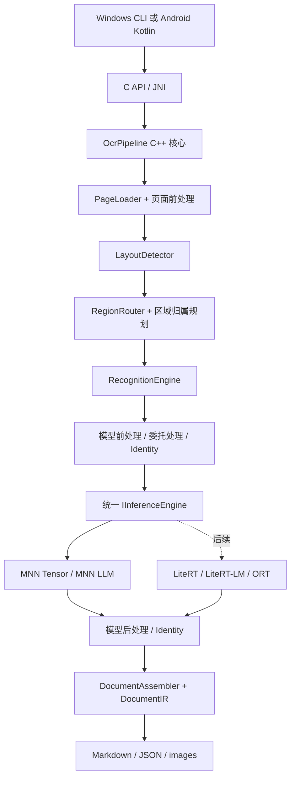

# 端侧文档理解系统：需求与设计文档

版本：1.1 草案；资料核对日期：2026-09-26。

本设计根据用户提供的 OCR 调研及本轮确认编写。**首版在 Windows 上实现 Layout + VLM，全流程优先 MNN；后续迁移 Android，通过 JNI 调用同一套 C++ 核心。**传统 det+rec 路线保留完整架构位置，放在后续阶段。交付物是设计文档，不代表模型已经转换成功或完成设备性能验证。

## 阅读入口

| 文档 | 主要读者 | 内容 |
|---|---|---|
| [需求与处理流程](01-需求与处理流程.md) | 产品、算法、开发者 | 需求、模型约束、前处理、后处理、坐标、路由、文档输出 |
| [统一引擎与平台接口](02-统一引擎与平台接口.md) | C++、Android、引擎开发者 | 统一接口、可选处理链、MNN/LiteRT 适配、生命周期、JNI、构建 |
| [实施验收与参考依据](03-实施验收与参考依据.md) | 实现 Agent、技术负责人 | 开发顺序、验收用例、RapidDoc 源码映射、证据与未决项 |
| [确定模型与配置决策](04-确定模型与配置决策.md) | 全部读者 | PP-DocLayoutV3 + OvisOCR2 的实际包信息、配置管理与处理决策 |

首版模型已经明确为 `dr3334/PP-DocLayoutV3-mnn` + `dr3334/ovrics-ocrv2_mnn`。GLM 是后续扩展，不参与首版默认选型。已经通过 ModelScope API 核对文件清单与小型配置文件；权重推理和数值对齐仍待验证。拟议配置见 [pipeline.yaml](configs/pipeline.yaml)。

核心结构：

统一接口统一的是调用、生命周期和错误语义，不假设张量网络与自回归 VLM 具有相同输入。前后处理允许为空，但输入输出验证、坐标追踪和文档序列化始终存在。业务层不得依赖 MNN、LiteRT、JNI 类型。

尚未收到现有 C++ 引擎代码，因此本文接口是建议契约；接入已有工程时先做接口差异映射，再决定采用、适配或替换。芯片、内存、速度目标尚未确认，文档不虚构性能承诺。
