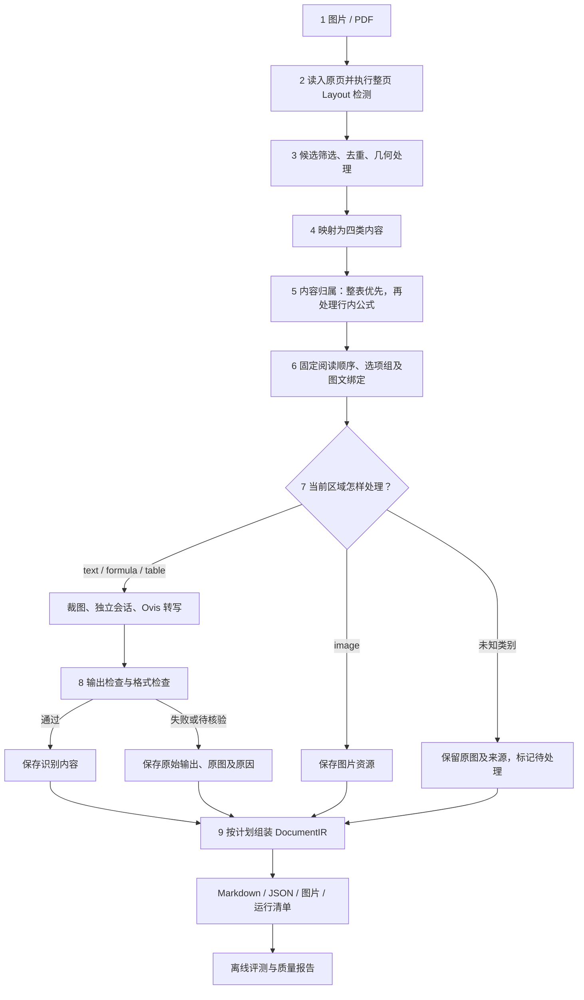

# DocLayout 分类与完整处理流程

2026-10-02，按用户要求整理为明显的分类与处理顺序。下表和主流程描述当前实现；末尾记录本次诊断及授权后的校验修复。#26 已实现统一路由，#27/#28/#29 继续沿用。

## 只看四类内容，Ovis 只识别前三类

| 展示顺序 | 内容类型 | 包含什么 | 怎么处理 |
| --- | --- | --- | --- |
| 1 | 文字 `text` | 正文、标题、图注、脚注、页眉页脚、编号、摘要、参考文献等 | 调用 Ovis 转写；正文中的行内公式随正文输出 |
| 2 | 公式 `formula` | 未归属正文或表格的独立公式 | 调用 Ovis 转写为 LaTeX |
| 3 | 表格 `table` | 整张表及其内部文字、公式 | 整表调用 Ovis，子块不再重复识别 |
| 4 | 图片 `image` | 插图、图表、印章、选项图 | 保存图片，Markdown 引用图片地址，不调用 Ovis |

这四个编号用于看分类，**实际识别与导出按页面阅读顺序进行，不是先认完全部文字再认公式、表格。** 标题、页码、图注等只是文字的版面用途，不增加识别任务。

模型的 25 个 class ID 全部归到上面四类，原始标签保留为来源和版面用途提示。集中映射见 `src/layout_region_policy.cpp`：

| 最终类别 | 完整来源映射（class ID：原始 label） |
| --- | --- |
| `text`，19 个 | 0: abstract；1: algorithm；2: aside_text；4: content；6: doc_title；7: figure_title；8/9: footer；10: footnote；11: formula_number；12/13: header；16: number；17: paragraph_title；18: reference；19: reference_content；22/23: text；24: vision_footnote |
| `formula`，2 个 | 5/15: formula |
| `table`，1 个 | 21: table |
| `image`，3 个 | 3: chart；14: image；20: seal |

同名标签保留不同的原始 class ID。模型范围外的未知类别保留原框、来源及原图，标记待处理；不猜成正文或静默丢弃。当前 JSON 使用 `unknown` 作为未知来源的兜底类型；已支持的日常内容仍只看上面四类，未在本次文档整理中修改 Schema。

## 从输入到导出的顺序

1. **读入页面。** 图片直接解码；PDF 按所选页范围栅格化，保留原页序与原图。
2. **整页检测。** 对 Layout 输入执行当前配置的缩放、归一化，调用 PP-DocLayoutV3，得到类别、分数、框、rank 和 mask，并回映原页坐标。
3. **整理候选。** 执行分数筛选、NMS、包含与外层重叠处理；记录保留、过滤和裁图原因。当前生产行为不等同于 #28 尚待完整核验的官方处理链。
4. **映射四类。** 用原始 class ID 决定 `text / formula / table / image`；细分 label 继续保留为来源和版面提示。
5. **确定内容归属。** 先把表格内的文字/公式归整表，再把正文内的行内公式归正文；独立公式单独保留。父区域裁图覆盖已归属内容，子块不重复调用 Ovis。归属不明确时保留独立区域。
6. **确定阅读顺序和图文关系。** 在识别前固定区域、顺序、横排选项组及图片/标签绑定。优先使用可用且无冲突的模型 rank，否则按分段、分栏和几何位置排序；双栏按段内左栏、右栏，横排选项按从左到右。失败不改变已固定的区域身份与结构。
7. **识别或保存资源。** 按计划依次裁图并识别三类 OCR 区域，每区域重置会话；图片保存为资源。文字/公式/表格共享当前 Ovis 转写提示词，输出后的解释按类型区分。只对可明确修正的 token 上限或缺少视觉输入问题最多重试一次；普通语法校验失败当前不触发重试。
8. **检查输出并记录状态。** 核对视觉输入、正常结束、空输出、截断、重复片段，再检查行内公式、独立公式和表格结构。正常完成的试卷留空表达式及本轮补齐的数学命令可以展示。原始输出始终保留；未通过结构校验的块仍为 `partial`，Markdown 展示原图和待核验提示。
9. **组装并导出。** 按识别前阅读顺序形成 DocumentIR，补充可确认的语义关系，导出 Markdown、JSON、图片和运行清单。JSON 可通过同一生产导出器重新导出，无需再次推理。

评测在生产输出之后进行。GT 标注、CER 和九项冻结门槛用于评估结果，不用于决定页面标签，也不是用户每次解析文档要满足的输入条件。GT 框与 Region 可以多对一，内容输出一次即可；不要求每个原始标签建立独立识别任务。

## 简化后的处理边界

- **正常文字都归 text。** 标题、图注、页眉页脚和编号不增加任务类型，也不因为尚未建立某种关系而被判定为识别错误。
- **内容只认一次。** 已归属正文/表格的子块不重复识别；图片保存成功是正常输出。两者都不记作 Ovis 成功或失败。
- **skip 是处理动作。** 水印、装饰或明确无需保留的标签可由 #28/#29 添加有依据的 skip 策略，保留原因；未知内容继续保留。当前 class 18 的既有 `outer_reference` 筛选沿用，未新增可配置的其他标签 skip。已执行但失败的识别不能改记为 skip。
- **内容类型与识别状态分别记录。** `text` 仍然是文字，`partial` 表示输出待核验；校验失败不改分类，不删除原始输出。

## 本次诊断与校验修复

初次公共 CLI 重放确认：`$A(g) \rightleftharpoons P(g)$`、单个 `\rightleftharpoons` 数学片段及试卷待填写的 `$z=$` 都正确路由到 `text`，随后被 `invalid_inline_formula_syntax` 拒绝。根因分别是公式命令白名单未覆盖可用命令，以及禁止表达式以等号结尾；正文检查复用这套公式解析，导致整块正文退回原图。

用户随后明确授权实现修复。本轮已支持反应箭头、历史失败输出中的常用数学符号、向量、带文字标签的箭头和三至四字母的大写几何点名；允许正常完成的表达式以等号留空。箭头标签仍检查参数、括号和其中的命令，未闭合、缺参数、未知命令、生成截断及重复检查继续生效。首次导出与 JSON 重新导出沿用同一公式检查和 Markdown 渲染链。

`\rightleftharpoons` 等支持依据见 [KaTeX 数学命令文档](https://katex.org/docs/supported.html)。修复范围、回归和历史文本重放见 [渲染修复记录](../issue-27/rendering-fix.md)。Schema、原质量门槛与历史成绩保持原样，历史 `partial` 文档不会被重新导出器自动改成成功；新规则用于新作业的校验。

#27 继续处理尚未满足的识别质量；#28 核验官方后处理；#29 处理水印与装饰误检。
