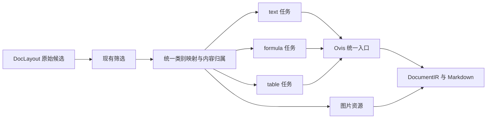

# Issue #26：DocLayout 到 Ovis 三类识别区域的统一映射计划

状态：核心映射与资源路由已实施；2026-10-01完成 odb-07/08 两页真实实测。详见 [实测与 Markdown](region-mapping-07-08.md)。

用户本轮修订：图片字段明确使用 image，而不是 null；仅 text / formula / table 调用 Ovis。最新1.9已完成一次 [完整20页新生产验收](acceptance-20-v1.9.md)，25项回归通过；下文“现状与问题来源”保留实施前1.8的诊断基线。

第1项“短题干、无独立标签横排图组”按用户确认视为已解决，本计划聚焦第2项的分类与字段映射。目标是让所有调用方共用一套识别类型、内容归属和资源路由，减少由 DocLayout 细分类别引起的重复分支与无效诊断。

## 现状与问题来源

当前已有类型映射：`canonical_label()` 把文字细类映射为 text、公式映射为 formula、表格映射为 table，图片另走资源路径；`GenerationRequest.task` 也已限定为 text / formula / table。Ovis 后端三类共享同一提示词，类型主要用于区域调度及输出解析/校验。不能把本次工作描述成从零增加三种提示词或三种模型接口。

问题在于映射没有成为后续处理的统一依据：

1. 图注规划仍按原始 `model_label` 分支。`figure_title` 可以作为单图图注；普通 text 只有进入图片组才保存绑定；`vision_footnote` 直接被排除。因此同样已映射为 text 的内容，仍因来源细类走不同流程。
2. `Block.type` 同时承担识别类型和资源类型，图片也被记成 skipped，页面状态再按“任一块非 ok”计算。最新20页中有5页（odb-07/08/13/15/18）全部 OCR 块为 ok，却因图片未执行识别而标为 partial。
3. 同名标签不足以表达来源：冻结模型配置中 class 5/15 都叫 formula、8/9 都叫 footer、12/13 都叫 header。必须保留 class ID，不能仅凭字符串推断独立公式、内嵌公式或其他细类语义。

本批504个 Region 记录包含53个图片资源项，实际 OCR 块为451个：403个 ok、48个校验 partial；另有264个选中子块已归属于父区域。类型统一应明确这些区别，避免把资源项和已归属子块再算成识别任务。现有48个校验回退仍需按原规则处理。

代码证据：[类型映射](../../src/core.cpp)、[Ovis 请求字段](../../include/dococr/inference.hpp)、[结构规划](../../src/region_structure.cpp)、[Ovis 统一提示词](../../src/printed_page_mnn_backend.cpp)。基线见 [最终20页验收](acceptance-20.md)。

## 建议采用的设计

**识别任务只有 `text / formula / table`；图片保留为资源；原始类别保留为来源。内容归属先于识别任务生成。**

### 映射表

以下名称和 ID 来自仓库冻结的 `tests/fixtures/layout/reference-model-config.json`。这是**归属处理前**的基础映射；已归属子块最终由父区域的任务输出。

| DocLayout class ID | 当前原始标签 | 基础识别类型 | 处理方式 |
|---|---|---|---|
| 0、1、2、4、19、22、23 | abstract、algorithm、aside_text、content、reference_content、text | text | 按文字区域识别 |
| 6、17 | doc_title、paragraph_title | text | 标题用途作为内部排序提示，识别仍为 text |
| 7、10、24 | figure_title、footnote、vision_footnote | text | 按文字识别；作为注释用途提示，关联由统一几何规则判断 |
| 8、9、12、13 | footer、header | text | 按文字识别；保留页眉/页脚排序提示 |
| 11、16 | formula_number、number | text | 编号按文字识别，不送入公式任务 |
| 5、15 | formula | formula | 先解决归属；保留 class ID 和几何，不能由同名标签直接推断公式变体 |
| 21 | table | table | 整个表格区域识别，已归属的单元格文字/公式由表格输出 |
| 3、14、20 | chart、image、seal | image | 保留图像资源，执行次数为0 |
| 18 | reference | text | 映射定义完整；当前筛选会移除该类，此计划保持现有筛选行为 |
| 未知 ID | unknown | unknown | 保留原框/资源与一条明确的未知类别状态，不猜成 text |

### 最小字段契约

复用现有 `blocks[].type`、`source_region_ids`、`source_layout_block_ids`、资源引用与 `content_owned_by`，不再另外引入25种业务识别类型。

- `regions[].recognition_type`：新增，取值为 `text / formula / table / image / unknown`。image 表示资源类型，unknown 保留未支持的来源；二者均不产生 Ovis 任务。
- `structure_plan.recognition_order`：新增，只列出需要调用 Ovis 的 Region ID；由现有全部结构成员的 `region_order` 投影得到，在首次调用前固定。
- 原始 `class_id / model_label / rank / mask / bbox`：保持现有来源记录，不能覆盖成识别类型。新业务分支使用统一映射结果。
- 标题、注释、页眉/页脚用途：映射表集中提供内部提示，不增加一组必须由用户理解的诊断字段。它们可以参与排序和关联，不能改变 Ovis 的三类任务定义。

例如，`figure_title`、`vision_footnote`、普通 text 的识别字段都为 `recognition_type: "text"`；image 为 `recognition_type: "image"`。原始来源标签仍可追溯。

图片在现有 IR 中也占用 Region 坐标记录。兼容迁移时保留这些引用，用 image 明确其走资源路径，实际 Ovis 调度只使用三类任务。校验要求 OCR 区域的 `recognition_type` 与输出块 `type` 一致；图片资源使用 image，未支持来源使用 unknown，不能借资源类型隐藏失败的 text/formula/table 任务。

### 内容归属规则

1. **正文包含内嵌公式**：已确认归属于正文的公式保留为 LayoutBlock 来源，父 text Region 的裁图包含其内容，只产生一次 text 任务，不额外识别子公式。
2. **表格包含文字/公式**：子块由父 table Region 唯一输出，只产生一次 table 任务。
3. **独立公式**：保留 formula 任务，不能因为映射后都叫 formula 就将独立公式当成内嵌公式吞入正文。用现有独立/内嵌反例固定行为；同名 class 5/15 的区别以来源 ID 和已核实契约处理，不自行补造标签。
4. **未能唯一归属的公式**：保留 formula 任务和原图，不因缺少父 text Region 丢弃内容。
5. **图片与文字图注**：图片是资源，图注是 text 任务；关联使输出相邻，不合并两者裁图，不把图片改成 text。

首阶段复用现有0.85正文归属、0.9表格归属与裁图并集规则。类型集中化时保持原候选、身份、裁图和所有权；发现独立公式归属冲突时只对该反例修复并列明差异，不同时启动全量阈值调优。

### 图注与诊断的简化

图注规划接收“归一化后的 text 区域 + 图片资源 + 几何”，取消“只有 figure_title 可独立绑定”“vision_footnote 不是候选”的原始标签硬限制。注释提示可帮助选择合理的形状/位置规则；普通短 text 也可在唯一几何证据成立时绑定单图。

- odb-07：斐波那契说明映射为 text，按照图片下方、横向覆盖和距离证据处理，不能因 `vision_footnote` 被直接跳过。
- odb-08：“第8题”映射为 text，允许绑定对应单图，不要求该图先进入横排组。
- 真正脚注、标题、页眉/页脚仍保留用途。图注关联必须有几何证据；存在同等竞争或明显冲突时保留不确定引用，复用已有原图提示。

只对影响输出的实际冲突、未知类别、识别/校验失败保留状态。不为正常 text 细类增加告警，也不为每个不属于图注的 text 都输出“未绑定”提示。

### 图片资源状态

资源保存成功属于正常输出。新文档的图片块可记为 `status=ok`、`recognition_type=image`，没有生成尝试记录，识别进度和成功次数只统计三类 OCR 任务。资源缺失、裁图失败或预算失败仍需正常报错。

页面状态聚合时区分 OCR 结果和资源处理结果，避免仅因图片无需 OCR 而标为 partial。预计上述5页可以消除这类状态噪声；这是状态口径修正，不能当成模型精度提升。48个公式/表格校验 partial 不因本计划被隐藏或改为 ok。

## 实施顺序

| 步骤 | 交付 | 涉及文件 |
|---|---|---|
| 1. 集中映射 | 一份完整类别表、内部区域类型枚举、三类 Ovis 任务判断及来源用途提示；替换分散的类型判断 | 新 `src/layout_region_policy.hpp/.cpp`，`src/core.cpp`，`CMakeLists.txt` |
| 2. 消费统一结果 | 内容归属、图注规划、识别调度、结果解析/校验使用同一类型；资源不进入 Ovis | `src/core.cpp`、`src/region_structure.hpp/.cpp`、`src/region_recognition.hpp/.cpp`，必要时 `src/printed_page_mnn_backend.cpp` |
| 3. 字段与状态落地 | typed Region、实际识别顺序、资源正常状态及等价导出 | 新 DocumentIR 1.9 image/pdf schema，`src/schema_validator.cpp`、`src/document_schemas.hpp.in`、`src/pdf_job.cpp`、`src/reexport.cpp`、相应导出代码 |
| 4. 验证 | 映射与归属受控回归、重点真实页、20页对照与最终冻结运行 | 现有公共 CLI 测试与 `scripts/issue26_*` 验收工具 |

映射模块使用小型确定性 Interface，集中查表及用途规则。复用现有结构规划和识别入口，不增加注册中心、插件、每类别 Adapter 或多层诊断框架。C ABI 和 `GenerationRequest.task` 的现有字符串契约保留，内部枚举在一个位置转成三种标准字符串。

新增公开字段、资源状态和识别顺序含义采用1.9契约。1.0～1.8按各自原契约读取与重新导出，不给历史文档补造新的识别前计划；#24/#25 已冻结的1.7验收工具和历史结果保持原样。

## 验收条件

- 公共作业中，普通 text、figure_title、footnote、vision_footnote 均进入 text 任务；formula_number/number 不误入 formula 任务。验证标题/页眉/脚注用途没有丢失。
- 接口实际收到的识别任务只有三类；图片/图表/印章不触发识别。资源成功不计为文字识别成功，也不产生“未执行 OCR”的错误。
- 正文+内嵌公式、表格+子块各只有一个内容输出所有者；已确认独立公式和无父区域公式保留内容。原框、来源、mask/rank和裁图可追溯。
- odb-07 人物说明、odb-08“第8题”显式关联正确；增加“真正脚注靠近图片”“短正文靠近插图”“候选竞争”等反例，防止扩大映射后误绑。
- 原第17/18题及已经通过的图片组顺序保持；首次 Markdown 与生产重新导出等价，旧版本回归通过。
- 日常验证使用受控公共回归和冻结20页重放；重点2页的新真实识别核对模型输入与文字输出。最终实现冻结后执行一次完整20页新生产运行，保留历史基线，分别记录结构变化和状态口径变化。

当前451个实际 OCR 块仅作这批冻结输入的对照数，不硬编码成未来所有页面必须达到的数量；新增/减少任务需要对应明确的来源与归属变化。已有147个 GT 错序和48个校验回退按原记录保留，本计划不承诺统一映射可以自动解决全部排序或语法问题。

## 审阅要点

请重点看三个设计选择：三类识别类型与图片资源的区分；正文内嵌公式/表格子块的唯一归属；细分类别只提供集中定义的版面用途、图注关联使用统一几何规则。第2项按这个设计推进，避免继续给原始类别逐个补特例。
