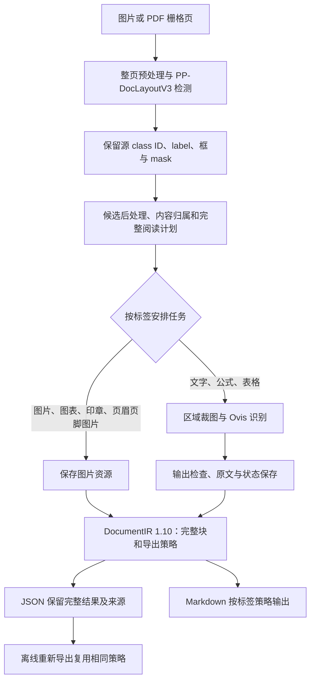

# Paddle 标签流水线与试卷密封线处理

2026-10-02。按用户要求复刻可用于当前端侧项目的标签处理规则。根因是已正确识别为 `aside_text` 的密封线字段仍被逐块导出到正文；修复在标签用途和导出策略处完成。

## 参考版本与流水线

参考 PaddleX 固定提交 `ffb64904d23708863ff5b8da312a5cbd52a7f462`，避免上游默认值变化：

- [PaddleOCR-VL-1.5 配置](https://github.com/PaddlePaddle/PaddleX/blob/ffb64904d23708863ff5b8da312a5cbd52a7f462/paddlex/configs/pipelines/PaddleOCR-VL-1.5.yaml)：默认 Markdown 忽略标签。
- [pipeline.py](https://github.com/PaddlePaddle/PaddleX/blob/ffb64904d23708863ff5b8da312a5cbd52a7f462/paddlex/inference/pipelines/paddleocr_vl/pipeline.py)：文字、公式、表格识别和图片资源路由；图表、印章识别默认关闭。
- [result.py](https://github.com/PaddlePaddle/PaddleX/blob/ffb64904d23708863ff5b8da312a5cbd52a7f462/paddlex/inference/pipelines/paddleocr_vl/result.py)：JSON 保留块；`SKIP_ORDER_LABELS` 与忽略列表共同控制正文序号，忽略列表独立控制 Markdown。
- [uilts.py](https://github.com/PaddlePaddle/PaddleX/blob/ffb64904d23708863ff5b8da312a5cbd52a7f462/paddlex/inference/pipelines/paddleocr_vl/uilts.py)：`filter_overlap_boxes` 在裁图前过滤 `reference`。



`markdown_ignore_labels` 不跳过识别，也不把块标成 `skipped`。被忽略的文字仍调用 Ovis，保存原文、裁图和实际状态；其识别失败仍影响作业状态。`aside_text` 的版面用途独立于正文，避免参与图注及选项组的正文锚点判断。页眉/页脚图片 class 13/9 按图片资源处理，不调用 Ovis。

## 25 类具体映射

原有 `model_label` 的别名继续保留，`original_class_id` 决定明确的 `semantic_label`。不会根据“姓名”等关键词删除文字。下表的“正文序号”指 JSON 每块的 `block_order`，不是完整阅读顺序。

| ID | 保留的 model_label | semantic_label | 识别/资源类型 | 默认 Markdown | 正文序号 |
|---|---|---|---|---|---|
| 0 | abstract | abstract | text | 显示 | 编号 |
| 1 | algorithm | algorithm | text | 显示 | 编号 |
| 2 | aside_text | aside_text | text | 省略，JSON 保留 | null |
| 3 | chart | chart | image | 显示图片 | null |
| 4 | content | content | text | 显示 | 编号 |
| 5 | formula | display_formula | formula | 显示公式 | 编号 |
| 6 | doc_title | doc_title | text | 显示 | 编号 |
| 7 | figure_title | figure_title | text | 显示 | null |
| 8 | footer | footer | text | 省略，JSON 保留 | null |
| 9 | footer | footer_image | image | 省略，资源保留 | null |
| 10 | footnote | footnote | text | 省略，JSON 保留 | null |
| 11 | formula_number | formula_number | text | 默认省略，可开启 | 编号 |
| 12 | header | header | text | 省略，JSON 保留 | null |
| 13 | header | header_image | image | 省略，资源保留 | null |
| 14 | image | image | image | 显示图片 | null |
| 15 | formula | inline_formula | formula；已归属时由父文本输出 | 显示公式或父文本内容 | 独立输出时编号 |
| 16 | number | number | text | 省略，JSON 保留 | null |
| 17 | paragraph_title | paragraph_title | text | 显示 | 编号 |
| 18 | reference | reference | 外层候选过滤 | 不输出，原始候选保留 | 无独立输出块 |
| 19 | reference_content | reference_content | text | 显示 | 编号 |
| 20 | seal | seal | image | 显示图片 | 编号 |
| 21 | table | table | table | 显示表格 | null |
| 22 | text | text | text | 显示 | 编号 |
| 23 | text | vertical_text | text | 显示 | 编号 |
| 24 | vision_footnote | vision_footnote | text | 显示 | null |

`seal` 表示印章，不表示试卷密封线。`footnote` 和 `vision_footnote` 的默认展示不同，不能按名称相似合并。未知类别保留源 ID 与原图占位，沿用显式待处理状态。表格内文字和内嵌公式的唯一归属保持原有逻辑，子 LayoutBlock 仍可追溯，不生成重复输出。

Paddle 的序号跳过名单没有 `seal`；因此印章图片默认有正文序号。图注、图表、表格等虽可展示，正文序号仍为 `null`。前端须用完整 `reading_order` 或 `structure_plan.block_order` 排列所有块，不能丢弃序号为 `null` 的可见图片或表格。

## 具体试卷对应

样例为已曝光开发页 `odb-01`，页面尺寸 3308×2339，密封线约位于 x=176～177。来源、坐标测量和修复前失败证据见 [诊断记录](diagnostics/seal-margin/README.md)。

| 页面内容 | 源类别及框 | 处理结果 |
|---|---|---|
| 左侧 `## 姓名` | b0041，class 2，`[105,1932,155,2015]` | 继续文字识别；JSON 保存原文、实际 `ok` 状态、裁图；`block_order=null`；Markdown 省略 |
| “答卷前，考生务必将自己的姓名、准考证号填写在答题卡上。” | b0009，class 22，`[295,489,1105,534]` | 普通正文，Markdown 保留；此页 `block_order=5` |
| 得分、阅卷人表格 | b0016，class 21 | 整表识别并输出表格；`block_order=null`；表内文字不重复输出 |
| 题目插图 | b0035，class 3 | 保存并引用图片；`block_order=null` |
| “电子信息制造业企业利润总额增速 / 工业企业利润总额增速”两条图例 | 同一个 b0042，class 24，`[456,2101,1296,2133]` | `vision_footnote → text`，保留文字；`block_order=null`；当前无 `caption_of` 关联 |

两条图例对应折线图中的三角形与圆点曲线。Ovis 原始输出为两行 `## ...`；当前 Markdown 导出保留这些符号，所以显示成两个二级标题，并非检测为 `doc_title` 或 `paragraph_title`。本轮未修复该展示问题。后续应按图例/图说明用途输出普通文字，在展示层去除误生成的标题前缀、保留 JSON 原文，并用可靠的几何关系关联图表；不能将 `vision_footnote` 当成默认忽略的 `footnote` 删除。

另一页 `odb-02` 中含“答案”“解析”的块仍属于 class 22，继续作为文字保留。Paddle 的这 25 类没有独立的“题干/答案/解析”标签；本轮解决的是密封线信息进入正文的问题，未增加题目语义分类器。

## 配置和保存后的契约

在现有配置的 `execution` 中设置，示例配置已经包含默认值：

```json
{
  "markdown_ignore_labels": [
    "number", "footnote", "header", "header_image", "footer", "footer_image", "aside_text"
  ],
  "show_formula_number": false
}
```

列表替换默认列表；缺省使用上述默认值，`[]` 表示保留所有标签。教材需要恢复旁注时，可从列表中移除 `aside_text`。配置使用表中的 `semantic_label`，拒绝未知名称、重复项及错误类型。`show_formula_number=true` 允许独立公式编号进入 Markdown；若它也在忽略列表中，仍省略。

DocumentIR 1.10 新增：

- 根 `export_policy`：固定策略名、实际忽略列表和公式编号开关；有效执行计划同时记录 `resolved_export_policy`。
- `layout_blocks[].semantic_label`：由源 class ID 映射，原始 ID 和模型别名不改写。
- `blocks[].block_order`：按完整阅读顺序，为不在 Paddle 序号跳过名单及忽略列表内的块从 1 连续编号，每页重新开始；其他块为 `null`。

源版面、识别区域、块、原始输出、资源引用、完整阅读计划及错误状态全部保留。首次导出与离线导出调用同一标签策略。重新导出会校验语义标签、任务路由及正文序号与策略一致。1.0～1.9 使用冻结的旧 Schema 和原版本展示行为；给旧 JSON 改版本号不能替代契约迁移。

当前仍使用 OvisOCR2/MNN 识别及已有的几何、归属和输出检查实现。本轮对齐标签路由、默认忽略标签、JSON 序号和输出保留；Paddle 的模型、图像拼接、相邻块合并与完整后处理数值一致性仍由 [#28](https://github.com/bestkojima/docprase/issues/28) 跟踪。

此策略依赖版面检测正确给出 `aside_text`；若身份栏被误标为 `text`，仍需修正版面分类或加入可靠的几何证据。本轮未增加通用密封线检测器。

## 回归证据

修复前 `tests/label_pipeline.py` 在公共 CLI 边界失败：`AssertionError: 密封线 aside_text 混入正文`。修复后覆盖 25 类路由、同名正文保留、JSON/裁图保留、恢复全部标签、自定义列表、未知类别、旁注失败状态、无效配置、多页 PDF、离线导出及 1.9 历史行为。

两页完整原始张量/mask 和历史 Ovis 输出重放结果：八处身份字段泄漏降为零，11+9 个旁注块完整保留，正文填写说明保留，首次与离线导出文件一致。轻量证据见 [fixed-replay-evidence.json](diagnostics/seal-margin/fixed-replay-evidence.json)，可浏览结果在本地 `output/seal-margin-label-pipeline-verified-20261002/`。

当前构建的 30 项 CTest 全部通过；旧版 Schema 与历史来源 SHA 核验通过。既有结构、数学输出、重试、取消和资源导出回归同时通过。

```sh
cmake --build build/linux-current -j4
ctest --test-dir build/linux-current --output-on-failure -j4
python3 docs/diagnostics/seal-margin/replay.py --mode original
```

这是确定性重放验证，未执行新的模型推理；两页为开发样本，不扩大为未见文档质量结论。
